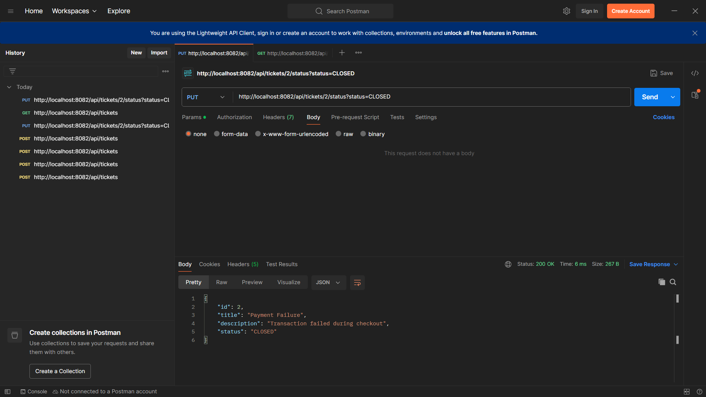

# Ticket Management System – Spring Boot REST API

## About the Project
This project is a simple backend application built using Spring Boot to manage support tickets.  
It allows users to create tickets, view all tickets, and update the ticket status through REST APIs.

The main goal of this project was to understand how real-world backend systems are structured and how APIs are designed and tested.

## Demo Screenshots

The screenshots below show the complete working flow of the Ticket Management System.
First, a new ticket is created using a POST API request by providing basic details such as title and description. The application automatically generates a unique ticket ID and assigns an initial status of OPEN.
Next, the status of an existing ticket is updated using a PUT request. The ticket ID is passed in the URL, and the status is changed from OPEN to CLOSED, demonstrating how ticket workflow and state changes are handled.
Finally, all tickets are fetched using a GET API request. The response returns a list of tickets along with their current statuses, confirming that ticket creation and updates are stored and reflected correctly in the system.





## Technologies Used
- Java
- Spring Boot
- Spring Web (REST APIs)
- H2 In-Memory Database
- Maven

## What This Application Does
- Create a new support ticket
- Fetch all existing tickets
- Update the status of a ticket (OPEN or CLOSED)
- Follows a clean Controller–Service structure

## API Endpoints

POST `/api/tickets`  
Creates a new ticket

GET `/api/tickets`  
Returns all tickets

PUT `/api/tickets/{id}/status?status=CLOSED`  
Updates the status of a ticket

## Example Request (Create Ticket)
```json
{
  "title": "Login Issue",
  "description": "User unable to login"
}
